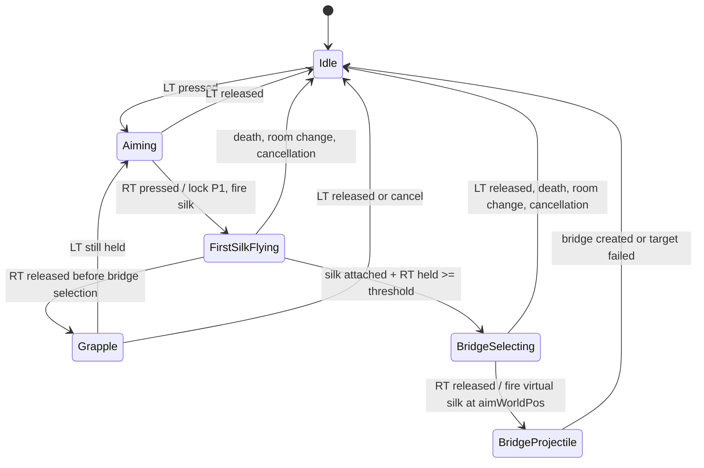

# SilkBridge 手柄输入与准星流程计划

## 范围

本文定义 Tinker 蛛丝的手柄输入、准星、钩爪和建桥流程。目标是兼容 Xbox 手柄与 DualSense (DS5) 的 USB、蓝牙和 Steam Input 模式。

本文档的 P0 输入、准星、状态机、Remix 设置和轨迹预览改造已完成并通过项目构建；DS5/Xbox 的设备识别与轴元素仍需按文末矩阵实机验证。

## 已核验事实

- `SilkAimInput.Player_Update_Input` 在 `orig()` 后取得本帧 `self.input[0]`，适合处理输入沿和状态转换。
- LT/RT 已通过 ImprovedInput 的 `PlayerKeybind` 提供；运行时读取入口是 `CustomInputExt.IsPressed`。
- `XInputReader` 按玩家编号读取 XInput 槽位；它只覆盖 Xbox 与 Steam Input 模拟的 DS5，不能作为 DS5 原生支持的唯一实现。
- `SilkPhysics.ShootAtPosition(Vector2)` 已存在，目标参数是世界坐标。
- `BridgeModeState.ShootVirtualSilk` 接受世界坐标目标，且虚拟丝飞行过程中受重力影响。

使用 ILSpy CLI 检查 `RainWorld_Data/Managed` 后确认：

- Remix `OptionInterface.config.Bind<T>` 保存至游戏自己的 `UserData/.../ModConfigs/<mod-id>.txt`，不使用 BepInEx 配置。
- `OpSlider` 仅接受整数 `Configurable`；死区、速度和长按时间应以整数保存，运行时换算。
- `OpComboBox` 支持 `Configurable<string>`。
- Rewired 的 `Joystick` 公开 `Axes`、`AxisElementIdentifiers`、`GetAxisRaw(int)`、`GetAxisRawById(int)` 与 `GetAxis2DRaw(int)`。
- 因此不能使用未定义动作的 `GetAxis("Right Stick Horizontal")`；右摇杆应读取 Rewired 原始物理轴，XInput 仅作回退。
- `RWInput.PlayerInputLogic(playerNumber)` 每帧调用 `PlayerRecentController(playerNumber)`，以该角色分配的键盘或摇杆更新 `options.controls[playerNumber]` 的活动控制器；随后把活动预设写入 `Player.InputPackage.gamePad`。
- 因此模组以 `self.input[0].gamePad` 作为唯一模式开关：真值进入手柄流程，假值进入键鼠流程。不得以“任意手柄已连接”或 Remix 开关覆盖游戏的每角色分配。

## 准星流程校准

### 正确的坐标规则

```text
鼠标世界坐标 = Futile.mousePosition + camera.pos
手柄屏幕坐标 = aimWorldPos - camera.pos
```

`RoomCamera.pos` 是世界/屏幕转换原点。手柄准星必须存储为世界坐标，并且 HUD 只进行一次 `world - camera.pos` 转换。

实现后只保留以下权威坐标：

```text
aimWorldPos           当前可见且可操作的准星世界坐标
firstTargetWorldPos   RT 按下时锁定的实体丝目标 P1
bridgeAnchorWorldPos  实体丝实际附着后的桥梁锚点 D2
previewHitWorldPos    虚拟丝模拟得到的预计首个命中点
```

- HUD 显示 `aimWorldPos - camera.pos`。
- 实体丝射向 `firstTargetWorldPos`。
- 虚拟丝射向 RT 松开时的 `aimWorldPos`。
- 最终桥梁起点是实际附着后的 `bridgeAnchorWorldPos`，不能是空气中的 P1。

### 当前实现的差异

| 问题 | 当前行为 | 计划要求 |
|---|---|---|
| 逻辑和显示不同步 | 实际使用 `cursorWorldPos`，画面显示滞后的 `cursorDisplayPos` | 以单一 `aimWorldPos` 同时驱动输入、射丝和 HUD |
| 输入时序 | HUD 更新时读取右摇杆 | 在 `Player.Update` 的 `orig()` 后采样一次；HUD 只渲染 |
| RT 状态 | `OnRTPress` 未被调用，`rtHeld` 失真 | 只由同一份输入快照驱动按下、持续和松开 |
| 建桥确认 | 长按进入桥梁模式后仍按住 RT 就发射虚拟丝 | 仅在 RT 松开沿确认并发射第二段丝 |
| 手柄预览 | `targetPreviewSprite` 被隐藏 | 桥梁选择中显示预计命中点 |
| 预览物理 | 现有预览是直线，虚拟丝受重力 | 预览与真实虚拟丝共享轨迹和碰撞逻辑 |
| 初始准星 | 先放在玩家前方，再由 HUD 可能夹取 | 输入阶段立即夹到当前相机边界 |

准星平滑若保留，必须先更新权威 `aimWorldPos` 再显示同一个值；不得保留独立、落后的视觉目标。

## 输入架构

```text
游戏控制器分配 ─> self.input[0].gamePad ─┐
                                         ├─> GamepadInputReader.Sample(player) ─> GamepadSnapshot
Rewired raw / XInput / ImprovedInput ────┘                                      │
                                                                                v
                                                                    GamepadBridgeState.Tick
                                                                                │
                                                                                ├─> SilkPhysics.ShootAtPosition
                                                                                ├─> BridgeModeState.ShootVirtualSilk
                                                                                └─> HUD rendering only
```

每位本地玩家每帧只生成一份 `GamepadSnapshot`：

```text
connected
backend: Auto / RewiredRaw / XInput
profile: Auto / Xbox / DualSense
rightStickRaw
rightStickFiltered
ltHeld, ltPressed, ltReleased
rtHeld, rtPressed, rtReleased
```

按下和松开沿应由同一快照的前值与当前值计算。不要混用 HUD 状态、多个字典缓存和 `JustPressed`。

### 右摇杆后端

1. `RewiredRaw`
   - 只读取当前 Rewired 玩家已分配的 `Joystick`。
   - 用 `hardwareIdentifier`、`deviceInstanceGuid`、`AxisElementIdentifiers` 识别设备和右摇杆元素。
   - 用 `GetAxisRawById` 或已经实机确认的原始轴索引读取 X/Y。
   - 这是 DS5 USB/蓝牙的优先路径。
2. `XInput`
   - 使用当前玩家关联的 XInput 槽位，不能硬编码 0。
   - 用于 Xbox，以及 Steam Input 将 DS5 模拟为 Xbox 时的回退。
3. `Auto`
   - 优先 Rewired 原始设备。
   - 无设备、无有效轴或读取失败时回退 XInput。
4. `ControllerProfile`
   - 提供 `Auto`、`Xbox`、`DualSense`，用于轴配对约束和故障排查。
   - 不能只靠档案名硬编码全部轴编号，因为 DS5 的 USB、蓝牙、Steam Input 布局可能不同。

### 右摇杆过滤

1. 读取原始二维轴。
2. 反转 Y，使向上摇杆对应世界正 Y。
3. 使用径向死区：当 $|v| \le d$ 时输出零；其余范围重映射到 $[0,1]$。
4. 限制长度不超过 1。
5. 用 `cursorSpeed * Time.unscaledDeltaTime` 更新 `aimWorldPos`。
6. 立即夹到当前相机的世界边界。

不要使用逐轴死区；它会破坏斜向速度的一致性。

## Remix Menu

在 `Options_Hook` 添加 `Gamepad` 标签页。所有值使用 `OptionInterface.config.Bind` 保存。

| 配置键 | 类型和控件 | 默认值 | 含义 |
|---|---|---|---|
| `Tinker_Gamepad_Backend` | `string` / `OpComboBox` | `Auto` | `Auto`、`RewiredRaw`、`XInput` |
| `Tinker_Gamepad_Profile` | `string` / `OpComboBox` | `Auto` | `Auto`、`Xbox`、`DualSense` |
| `Tinker_Gamepad_DeadzonePercent` | `int` / `OpSlider` | `20` | 5 至 45，对应 $0.05$ 至 $0.45$ |
| `Tinker_Gamepad_CursorSpeed` | `int` / `OpSlider` | `560` | 世界单位/秒 |
| `Tinker_Gamepad_BridgeHoldMs` | `int` / `OpSlider` | `135` | RT 建桥长按阈值 |

未安装 Improved Input 时，LT/RT 由当前玩家已分配 Rewired 摇杆的默认轴读取；安装后会自动注册可重绑定的 `Silk Aim (LT)` 与 `Silk Shoot (RT)`。不要用 `OpKeyBinder<KeyCode>` 替代触发器，因为 DS5 触发器可能作为轴而非 Unity `KeyCode` 暴露。

手柄/键鼠模式不提供 Remix 开关，始终跟随游戏 Input Options 中为每个角色分配的最近活动控制器。切换该角色的键鼠或手柄输入后，游戏会在下一帧更新 `self.input[0].gamePad`，模组随即切换流程。

## 状态机



在 `SilkAimInput.Player_Update_Input` 的 `orig()` 后按顺序执行：

1. 跳过远程 Rain Meadow 玩家。
2. 调用 `GamepadInputReader.Sample(self, playerNumber)` 一次。
3. 用快照更新 `GamepadBridgeState` 与 `aimWorldPos`，并立即夹取相机边界。
4. 处理 LT 沿：进入或取消瞄准。
5. 处理 RT 按下沿：锁定 P1、调用 `OnRTPress`、发射实体丝。
6. 实体丝实际附着且 RT 长按到阈值后，进入 `BridgeSelecting` 并固定 D2。
7. 处理 RT 松开沿：未进入 `BridgeSelecting` 时保留实体丝成为钩爪；已进入时以当前 `aimWorldPos` 发射虚拟丝。
8. 统一取消：死亡、换房、失去本地控制、LT 松开、能量不足或丝未命中。
9. 执行原有通用逻辑：收放绳、超级跳、桥梁物品分离和桥梁攀爬。

HUD 不得轮询手柄，也不得改变状态机。

### RT 规则

- `rtHeld` 只由快照驱动，RT 上升沿必须调用 `OnRTPress`。
- 长按阈值使用累计 `Time.unscaledDeltaTime`，不再用固定帧数；Remix 的毫秒设置不受帧率影响。
- 进入桥梁选择前必须确认实体丝真实附着。
- 松开 RT 前不得调用 `ShootVirtualSilk`。
- 对“已有附着丝时再按 RT”只保留一种明确规则：释放或重射，实施时不能同时触发两者。

## 准星和桥梁预览

`MouseRender` 的职责仅限于：

- 绘制 `aimWorldPos - camera.pos` 的蓝色手柄准星。
- 在 `BridgeSelecting` 显示 D2 红色锚点。
- 显示 `previewHitWorldPos`；无命中时隐藏预览。
- 相机为空、不是 Tinker 或状态取消时隐藏全部精灵。

`MouseRender` 不得读取 XInput/Rewired，也不得写入 `GamepadBridgeState`。

新增共享的纯计算预览函数，输入：

```text
room
bridgeAnchorWorldPos
aimWorldPos
current bridges
maximum range
```

该函数和 `UpdateVirtualSilk` 必须共享：初速度、重力、步长、地形/桥梁/物体/横梁碰撞顺序、`aimTarget` 附近的地形优先规则，以及最大距离与取消条件。这样绿色预测点与真实虚拟丝的首个命中点才会一致。

## 文件级实施计划

| 优先级 | 文件 | 修改 |
|---|---|---|
| P0 | `src/Options_Hook.cs` | 添加 Remix `Gamepad` 标签页与所有 `Configurable` 访问器 |
| P0 | `src/Silk/Bridge/GamepadInputReader.cs` | 新增快照、Rewired Raw/XInput/Auto 后端 |
| P0 | `src/Silk/Bridge/GamepadBridgeState.cs` | 使用权威 `aimWorldPos`、时间制 RT 状态和统一取消 |
| P0 | `src/Silk/SilkAimInput.cs` | `orig()` 后单次采样并驱动状态机 |
| P0 | `src/Mouse/MouseRender.cs` | 只渲染准星、锚点和预览，不再采样输入 |
| P0 | `src/Silk/Bridge/SilkBridgeManager.cs` | 提取运行时和预览共用的虚拟丝轨迹与碰撞计算 |
| P1 | `src/Silk/Bridge/XInputReader.cs` | 删除固定玩家 0 假设，支持解析后的 XInput 槽位 |
| P1 | `src/Silk/Bridge/OptionalImprovedInput.cs` | 可选检测 Improved Input 并注册可重绑定 LT/RT |
| P1 | 本文档 | 实机后记录 DS5 USB、DS5 蓝牙和 Xbox 的身份字符串与轴元素 ID |

## 验证矩阵

### 自动验证

1. `dotnet build src/Tinker.csproj` 成功。
2. 修改后的 C# 文件无编辑器诊断。
3. 状态机用最小纯函数测试覆盖：RT 按下、长按、松开、取消和目标锁定。
4. 对固定地图输入，预览模拟与运行时虚拟丝产生相同的首个命中点。

### 游戏内验证

| 设备和模式 | 必验行为 |
|---|---|
| Xbox 有线/无线 | LT 瞄准、右摇杆四向和斜向、RT 短按钩爪、RT 长按松开建桥 |
| DS5 USB，Steam Input 关闭 | Rewired Raw 能读右摇杆和 LT/RT |
| DS5 蓝牙，Steam Input 关闭 | 同上，并确认设备身份和轴元素不与 USB 混淆 |
| DS5 USB/蓝牙，Steam Input 开启 | Auto 正确回退 XInput |
| Remix 修改 | 修改后无需重启即可生效，且不保留旧准星或 RT 状态 |
| 相机移动 | 准星锁定同一世界点，屏幕位置随相机正确变化 |
| 桥梁选择 | 准星、D2、预测命中点和虚拟丝实际首个命中点一致 |
| 取消路径 | LT 松开、死亡、换房、远程玩家均不会残留准星、锚点或虚拟丝 |
| 键鼠切换 | 不会在同一帧触发键鼠和手柄的双重射丝 |

## 实机前限制

静态反编译已确认 Remix 与 Rewired 原始轴 API 能支持该架构，但无法仅靠 DLL 保证某个 DS5 固件、连接方式或 Steam Input 配置的实际轴元素 ID。首次实机测试应确认设备身份、候选轴和过滤后的右摇杆值，再把数据补充到本文档。